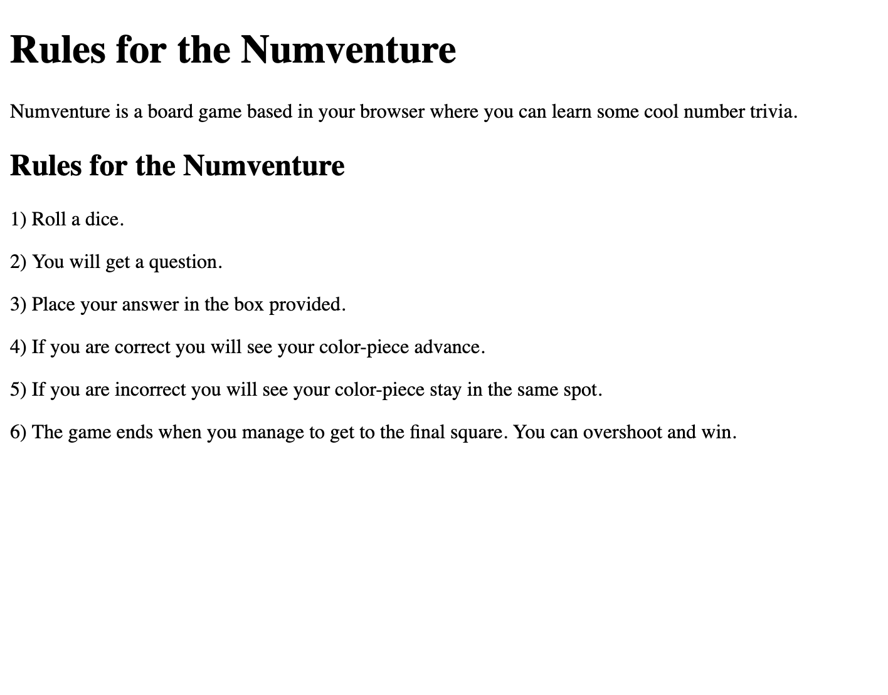

# Numventure

## Introduction
Numventure is a solo 2 day take home challenge style project for Module 4 of the [Back-End Engineering Program](https://turing.io/programs/back-end-engineering/) at the [Turing School of Software & Design](https://turing.io/). Numventure is a  application built using Next.JS. It calls the [NumbersAPI](http://numbersapi.com) to get number related trivia. [This repo](https://github.com/lptaylor/Numventure) contains the entire application.

[Deployed Site](https://numventure-idh11addm.now.sh/)

[Project Board](https://github.com/lptaylor/Numventure/projects/1)


## Features
Visitors to the Numventure app can roll a dice, which returns a random trivia question:


Visitors can learn to play the game by following the button at the top for the rules:


Visitors can also read a bit about the project and its vision by clicking the about button:


## Work in Progress

Since the full game has not been completed as of the date of this Readme the pending ideas and enhancements that need to be completed are found in the issues section of the Repo or under the Project Board.

## Initial Setup
To install this project on your local machine:
1. Clone the repo to your machine:
```
git clone git@github.com:lptaylor/Numventure.git
```
2. Change into the new directory.
3. Install dependencies:
```
npm install
```

4. Build:
```
npm run build
```

## Running the Server Locally
To run the code locally, use the following command to start the development server:
```
npm run dev
```
Once running, point your browser to:
```
http://localhost:3000/
```

## How to Contribute
If you wish to contribute to this repo, you are welcome to make a PR and I would be happy to review it.


## Built With
* [Next.js](https://nextjs.org/)
* [Zeit Now](https://zeit.co/now)

## Author
**[Lance Taylor](https://github.com/lptaylor)**
